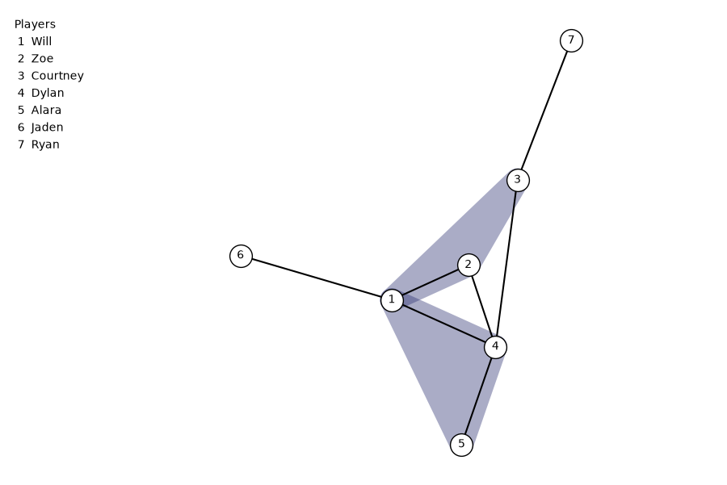

# Alliance Hypergraph Visualizer

A Python tool for storing and visualizing alliance networks using hypergraphs.

This project was originally developed to analyze alliance structures in a social strategy game. Unlike a traditional graph, where an edge connects two nodes, a hypergraph allows a single edge to connect any number of nodes. This makes hypergraphs a natural way to represent alliances involving multiple players.



*Example visualization generated from synthetic player and alliance data.*

## Features

- Store alliance networks using the **HIF (Hypergraph Interchange Format)** in JSON
- Create and remove alliances through a command-line interface
- Remove players from an alliance network
- Track metadata such as the round in which an alliance was created
- Generate hypergraph visualizations using **XGI**
- Generate numbered player legends to keep dense visualizations readable
- Load different HIF datasets through the CLI

## Technologies

- **Python**
- **XGI**
- **Matplotlib**
- **HIF / JSON**

## Project Structure

```text
Alliance-Hypergraph-Visualizer/
├── sample_data/
│   ├── sample_alliances.json
│   └── sample_figure.png
├── alliance_data_analyzer.py
├── alliance_data_editor.py
├── alliance_data_visualizer.py
├── alliance_json_format.md
├── cli.py
├── requirements.txt
├── .gitignore
└── README.md
```

- `alliance_data_editor.py` — Loads, modifies, and saves alliance data.
- `alliance_data_analyzer.py` — Analyzes statistics and features of alliance data.
- `alliance_data_visualizer.py` — Generates an XGI hypergraph visualization from an HIF dataset.
- `cli.py` — Provides the command-line interface for interacting with the application.
- `alliance_json_format.md` — Documents the JSON/HIF structure used by the application.
- `sample_data/` — Contains synthetic example data and its generated visualization.

## Installation

Clone the repository:

```bash
git clone https://github.com/willk03/Alliance-Hypergraph-Visualizer.git
cd Alliance-Hypergraph-Visualizer
```

Install the required packages:

```bash
pip install -r requirements.txt
```

## Usage

Run the command-line interface:

```bash
python cli.py
```

By default, the program loads the synthetic dataset in `sample_data/sample_alliances.json`.

The CLI can be used to add or remove alliances, remove players, list existing alliances, save changes, load another HIF dataset, and display the resulting hypergraph.

## Data

The real datasets used during development contain information from an ongoing game and are intentionally excluded from this repository.

The `sample_data` directory contains synthetic player and alliance data that demonstrates the application's functionality without exposing the original dataset.
